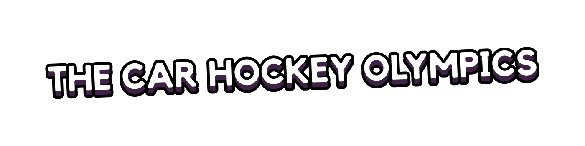
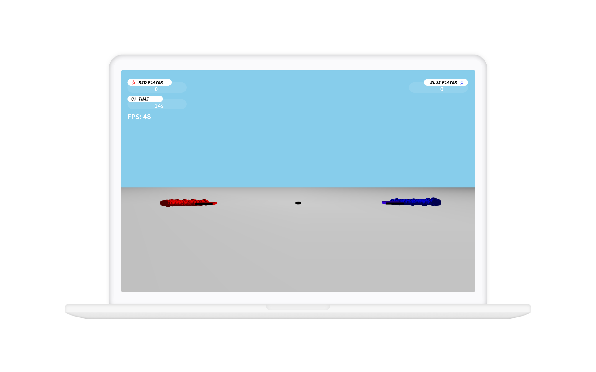

A mini openframeworks game. Two players race against each other to collect the pucks, first to 5 wins!

## 📷 Screens

(*Gameplay of The Car Hockey Olympics*)

## 🧠 Rationate

To demostrate architectures and object-oriented patterns for computer game design. Animation, simulation, user interfaces, graphics, and intelligent behaviors.

## 💻 Technologies

[**openFrameworks**](https://openframeworks.cc/) - An open source C++ toolkit designed to assist the creative process by providing a simple and intuitive framework for experimentation
- OpenGL for graphics
- FreeType for fonts
- FreeImage for image saving and loading
- Assimp for 3D model loading

## 🎴 How to Play it

In `bin` folder, run `TCHO.exe`

## 🕹 Controls

- **Player 1**: WASD
- **Player 2**: Arrow Keys
- **Camera control**: Mouse Drag
- **Quit**: Q

## 📔 License
All parts of this project are free to use and abuse under the open-source [MIT license](./LICENSE).

## 😉 Acknowledgement
Created by [Francisco Ibarra](https://github.com/Francisco-Ibarra07) and [Nhat Nguyen](https://github.com/nattwasm)
